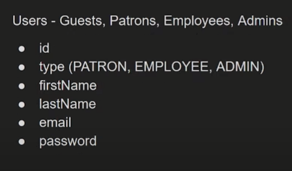
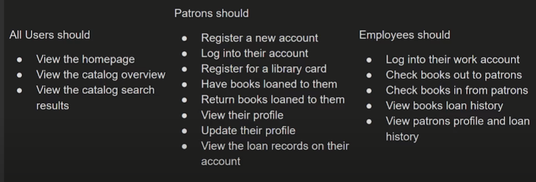
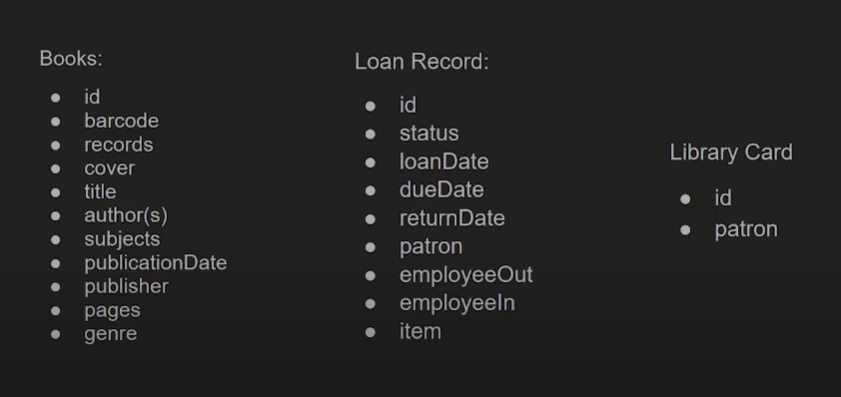

## Setting up Data Models, Data Access Objects, and Services

Our first data model is the User model. This model will contain the user's information such as name, email, password, and role. We will use this model to store user data in the database.

Let us analyze the requirement for the User model.

## User Stories

There are different types of users in this project. They are:







## User Data Model

Let us create our User Interface and User Schema.

```typescript
export interface IUser {
  userType: "ADMIN" | "EMPLOYEE" | "PATRON";
  firstName: string;
  lastName: string;
  email: string;
  password: string;
}
```

Now let us create our User Schema using Mongoose to interact with MongoDB. As you know internally MongoDB stores as a Document and it includes properties and methods that specific to MongoDB documents such as \_id, save, remove, etc. So let us first exptend our IUser interface to include the Document interface from Mongoose.

```typescript
export interface IUserModel extends IUser, Document {}
```

Now let us create our User Schema.

```typescript
import mongoose, { Schema, model } from "mongoose";
import { IUser } from "../models/User";

export interface IUserModel extends IUser, Document {}

const UserSchema: Schema = new Schema(
  {
    userType: { type: String, required: true },
    firstName: { type: String, required: true },
    lastName: { type: String, required: true },
    email: { type: String, required: true },
    password: { type: String, required: true },
  },
  {
    versionKey: false,
  }
);

const User = model<IUserModel>("User", UserSchema);

export default User;
```

In Mongoose Version Key is a version number that is used to handle versioning conflicts. By default, Mongoose adds a versionKey to all documents. We can disable this by setting the versionKey option to false.

```typescript
const User = model<IUserModel>("User", UserSchema);
```

is creating a Mongoose model named `User` using the `UserSchema` schema and the `IUserModel` TypeScript interface. Here's a detailed breakdown:

1. **`model<IUserModel>`**:

   - This is a generic function provided by Mongoose to create a model.
   - The generic type parameter `<IUserModel>` specifies that the model will conform to the `IUserModel` interface. This helps TypeScript understand the shape of the documents that will be created using this model.

2. **`'User'`**:

   - This is the name of the model. Mongoose will use this name to create a collection in the MongoDB database. By default, Mongoose will pluralize this name to create the collection name, so the collection will be named `users`.

3. **`UserSchema`**:
   - This is the schema definition for the `User` model. It defines the structure of the documents in the `users` collection, including the fields and their types.

Putting it all together, this line of code creates a Mongoose model named `User` that uses the `UserSchema` schema and adheres to the `IUserModel` interface. This model can then be used to interact with the `users` collection in the MongoDB database, allowing you to create, read, update, and delete documents.

Here's an example of how you might use this model:

```typescript
// Create a new user
const newUser = new User({
  userType: "PATRON",
  firstName: "John",
  lastName: "Doe",
  email: "john.doe@example.com",
  password: "securepassword",
});

// Save the new user to the database
newUser
  .save()
  .then((user) => console.log("User saved:", user))
  .catch((err) => console.error("Error saving user:", err));
```

In this example, `newUser` is an instance of the [`User`] model, and calling `save()` will save the document to the `users` collection in the MongoDB database.

## Data Layer Services

Now with DataModel and Data Access Object (DAO) in place, let us create a service to interact with the User model. Let us create a UserService class that will contain methods to perform CRUD operations on the User model.

```typescript
import bcrypt from "bcrypt";
import { config } from "../config";
import { IUser } from "../models/User";
import User, { IUserModel } from "../daos/UserDao";

export async function register(user: IUser): Promise<IUserModel> {
  const ROUNDS = config.server.rounds;
  try {
    const hashPassword = await bcrypt.hash(user.password, ROUNDS);
    const saved = new User({ ...user, password: hashPassword });
    return await saved.save();
  } catch (error) {
    throw new Error(`Unable to create user`);
  }
}
```
